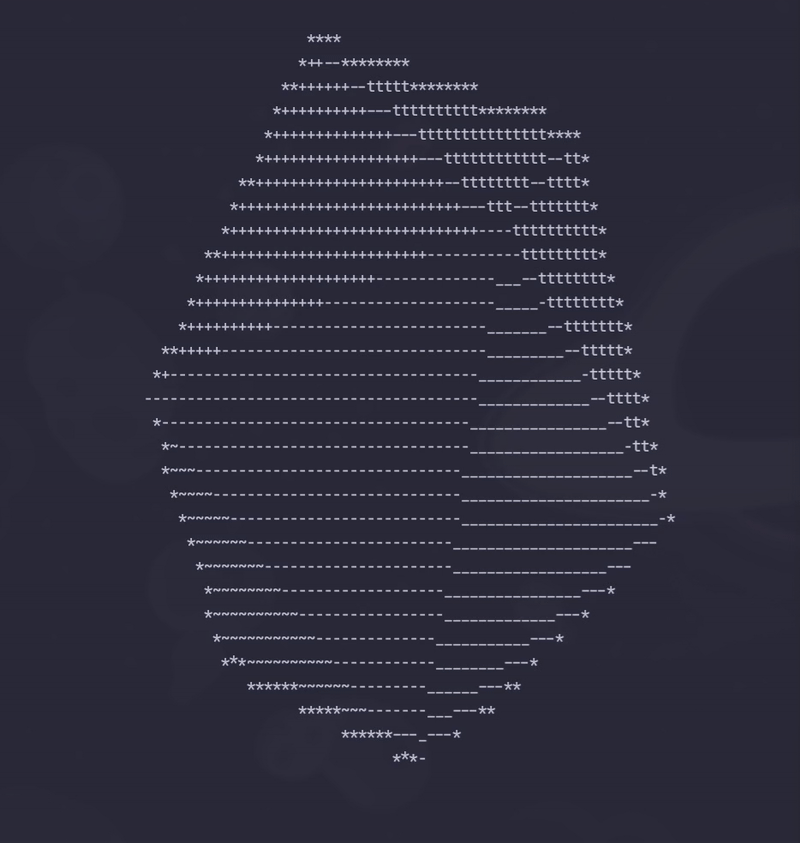

# spinning-icosahedron

Terminal-based 3D icosahedron renderer with real-time rotation and shading




## 🎯 Features

- **3D Rotation**: 3-axis rotation using rotation matrices
- **Perspective Projection**: Camera-based depth rendering
- **Z-Buffer**: Proper depth testing for overlapping faces
- **Flat Shading**: Lambert reflection model with diagonal lighting
- **Wireframe Overlay**: Edge rendering with Bresenham's line algorithm

## 🛠️ Technical Stack

- **Python 3.x**
- **NumPy**: Matrix operations & transformations
- **ANSI Escape Sequences**: Flicker-free terminal rendering

## 📦 Installation
```bash
pip install numpy
```

## 🚀 Usage
```bash
python icosahedron.py
```

Press `Ctrl+C` to exit.

## 📐 Implementation Details

### Geometry
- **Vertices**: 12 vertices using golden ratio φ = (1+√5)/2
- **Faces**: 20 equilateral triangular faces
- **Edges**: 30 edges

### Rendering Pipeline
1. **Rotation**: Apply 3-axis rotation matrices (X, Y, Z)
2. **Projection**: Perspective projection with auto-scaled FOV
3. **Rasterization**: 
   - Barycentric coordinates for triangle filling
   - Z-buffer for depth testing
   - Normal vector calculation for lighting
4. **Shading**: Lambert reflection model with 70-character ASCII gradient

### Key Algorithms
- **Bresenham's Line Algorithm**: Efficient edge rendering
- **Barycentric Coordinates**: Point-in-triangle test & Z-value interpolation
- **Z-Buffer**: Per-pixel depth comparison for correct occlusion

## ⚙️ Configuration

코드 상단에서 조정 가능한 설정:
```python
CAMERA_DIST = 5                    # 카메라 거리
light_dir = np.array([1, 1, 1]) / np.sqrt(3)  # 광원 방향 (오른쪽 위 앞, 정규화)
shade_chars = " .'`^\",:;Il..."    # 음영 문자 세트 (70개)
```

## 🎓 Learning Objectives

이 프로젝트를 통해 학습한 내용:

- ✅ NumPy를 활용한 3D 행렬 연산 (회전, 투영)
- ✅ Bresenham 직선 알고리즘 구현
- ✅ Z-Buffer 기반 깊이 판정
- ✅ 무게중심 좌표계 (Barycentric Coordinates)
- ✅ Lambert 반사 모델을 이용한 음영 처리
- ✅ 터미널 기반 실시간 렌더링 최적화

## 📂 Code Structure
```
icosahedron.py
├── Geometry Definition      # vertices, faces
├── Rotation Matrices        # rotation_matrix_x/y/z
├── Projection              # project (3D → 2D)
├── Rasterization           # fill_triangle, barycentric
├── Lighting & Shading      # normal calculation, Lambert model
└── Main Loop               # rendering pipeline
```

## 🤝 Acknowledgments

Claude Opus 4.6의 도움을 받아 학습 목적으로 제작되었습니다.

코드 개선(백페이스 컬링, NumPy 벡터화, 터미널 리사이즈 대응 등)은 [Claude Code](https://claude.ai/code)를 활용해 진행했습니다.

## 📝 License

MIT License
